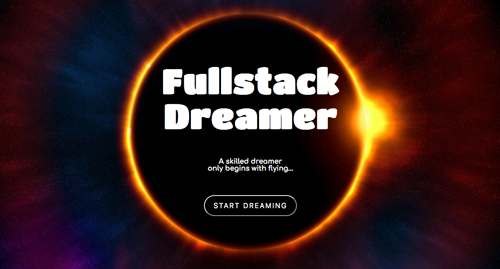
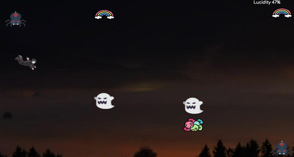
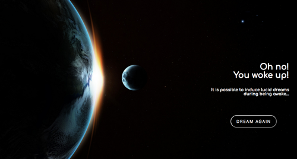

Fullstack Dreamer
- a 2D game to practice DOM and OOP.

Screenshots:

Future improvements: 

- [ ] Responsiveness (Now made for my screen at presentation)

- [ ] Additional levels for when lucidity level reaches 100%

- [ ] Shooting 'superpower'

Icons I used: 

<a href="https://www.flaticon.com/free-icons/spooky" title="spooky icons">Spooky icons created by Smashicons - Flaticon</a>

<a href="https://www.flaticon.com/free-icons/fear" title="fear icons">Fear icons created by Smashicons - Flaticon</a>

<a href="https://www.flaticon.com/free-icons/spider" title="spider icons">Spider icons created by Smashicons - Flaticon</a>

<a href="https://www.flaticon.com/free-icons/star" title="star icons">Star icons created by Freepik - Flaticon</a>

<a href="https://www.flaticon.com/free-icons/candy" title="candy icons">Candy icons created by Freepik - Flaticon</a>
